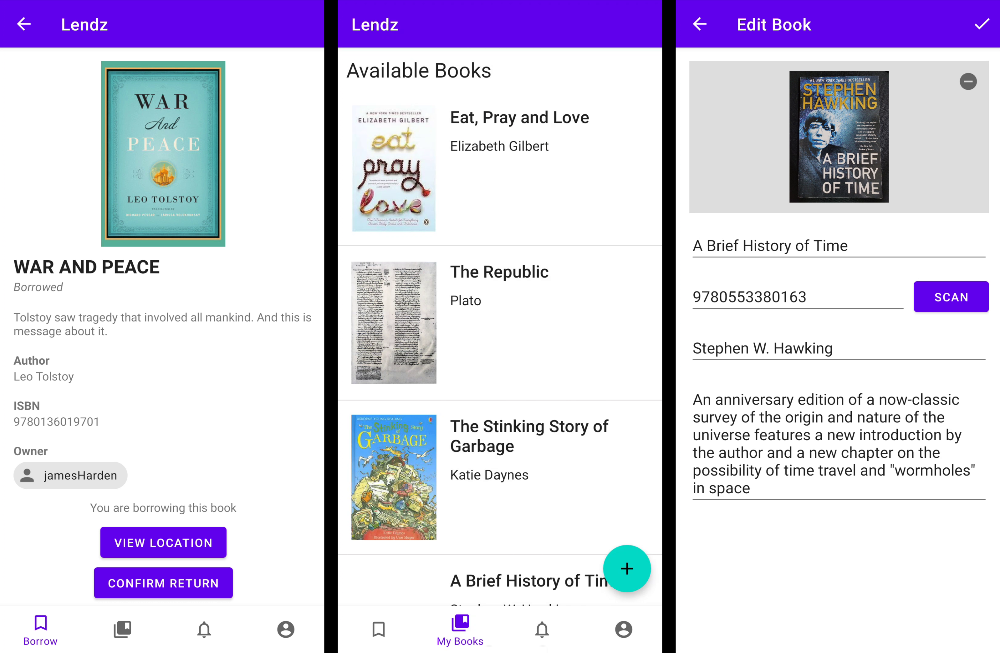

# Lendz

**Lendz** is an app that assists users with borrowing books from one another.

## Authors
* [Abdulrahman Bakare](https://github.com/aobakare)
* [Kwasi Boateng](https://github.com/kb-jboateng)
* [Andrews Essilfie](https://github.com/essilfie)
* [Kyle McLean](https://github.com/kylemclean)
* [Isaac Mensah](https://github.com/nsmensah)
* [Shohan Islam](https://github.com/sohanislam001)

## Documentation
[Javadocs](https://cmput301f20t19.github.io/lendz/javadoc/)

[Product Backlog](https://github.com/CMPUT301F20T19/lendz/projects/1)

[UML Diagrams and UI Mockups](https://github.com/CMPUT301F20T19/lendz/wiki/Home)

## Attribution
The app icon was made by [Good Ware](https://www.flaticon.com/authors/good-ware) on [www.flaticon.com](https://www.flaticon.com/).
